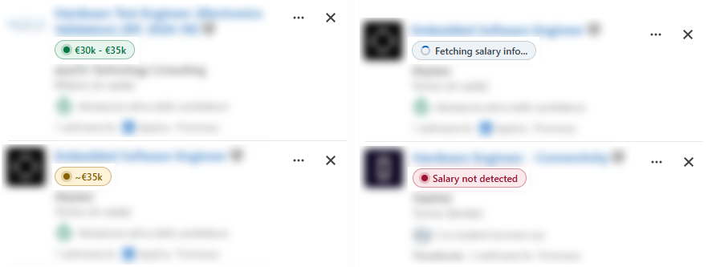
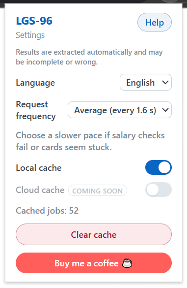
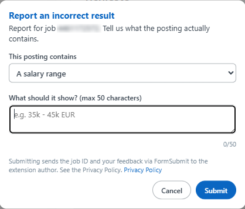

# LGS-96

Read this in other languages:
- :it: [Italian](README_IT.md)

LGS-96 is an unofficial Chrome extension that shows salary information found in
LinkedIn job postings directly on the job cards in the search results.  
The purpose of this project is to save you time by letting you skip the job opportunities you may not be
interested in from a salary standpoint.  
The extension takes its name from the Italian transparency decree **D.Lgs. 96/2026**, which requires salary
ranges to be published in job postings. A generous amount of companies, though, keep omitting it.

**LGS-96 is not affiliated with, endorsed by, or connected to LinkedIn in any way.**

## Features

 

- A compact badge on each LinkedIn job card summarizes what the posting contains:
  - :green_circle: green: a narrow salary range,
  - :yellow_circle: amber: a broad range or a single approximate value,
  - :red_circle: red: no salary information detected in the posting,
  - :white_circle: grey: the check is pending, or it could not be completed due to errors or exceptions.
- When a card has no salary text on its own, the extension reads the public job description
  (rate limited, with backoff) and extracts the salary range from its text, 
  with regional currency defaults and support for English and Italian postings.
- **Request frequency** setting (Slow / Average / Fast) controls the delay between
  requests to avoid being rate-limited on LinkedIn.
- **Local cache** of parsed results (3 days, can be disabled and cleared from the popup).
- **English** and **Italian** interfaces.
- Hover any badge and use the flag to **report an incorrect result**.

## Install the extension

### From the Chrome Web Store (recommended)

Download it from [here!](https://google.com)

### From source

1. Download or clone this repository.
2. Open `chrome://extensions` in Chrome.
3. Enable **Developer mode** (top right).
4. Click **Load unpacked** and select the `extension/` folder.

## How to use it

You can access the extension settings by clicking its icon in the top-right corner:  
  
- **Language:** select one of the supported languages. At the moment, only English and Italian are supported. Defaults to English.
- **Request frequency:** defines the minimum timeout between two consecutive requests to LinkedIn's API to retrieve the job description text. It has no effect on the speed of retrieval from the local cache. Change this to a higher value if you experience rate-limiting. Options are _Slow (2.5 s)_, _Average (1.6 s)_, and _Fast (1 s)_.
- **Local cache:** to save time, job scanning results of the last 3 days are saved in a local cache. When you see the same card again, the result is fetched from the local storage instead of LinkedIn's API. 
- **Cloud cache:** a feature I may add in the future. It consists in a centralized cache to which each user of the extension can contribute.
- **Clear cache:** pressing this button will empty the local cache **without a confirmation dialog.**
- **Buy me a coffee:** the most important feature in the extension - it sends you to [my Ko-Fi page](https://ko-fi.com/albertocastronovo) :heart:  

Just browse LinkedIn to see the magic happen!  
The currently supported pages are:  
- [`linkedin.com/jobs/`](https://www.linkedin.com/jobs/) (works on the 1-3 job cards shown at the beginning of the page)
- [`linkedin.com/search/results/all/`](https://www.linkedin.com/search/results/all/) (works on the _Job offers_ tab)

- [`linkedin.com/jobs/search-results/`](https://www.linkedin.com/jobs/search-results/)

- [`linkedin.com/jobs/collections/recommended`](https://www.linkedin.com/jobs/collections/recommended)

Se vedi un annuncio che l'estensione non riesce a intepretare correttamente puoi segnalarmelo passando il mouse sopra il badge colorato e cliccando sulla bandiera a sinistra. Si aprirà un popup che ti chiederà di inserire i valori che ti saresti aspettato di vedere.

If you find a job description that the extension fails to read correctly, you can report it to me by hovering over the colored badge and clicking on the flag on the left. In the popup that opens, you can write the information that the extension should have shown.

 

## Privacy

The extension stores only parsed results and your preferences in your browser's
local extension storage.  
**Job descriptions are parsed transiently in memory and are never stored or sent anywhere.**  
The only network destinations are LinkedIn (public
job-posting pages, exactly as your browser would) and, when you explicitly submit a
report, the [FormSubmit](https://formsubmit.co/) email relay service.

See [PRIVACY.md](PRIVACY.md) for the full privacy policy.

## Development

### Features

The project consists entirely in dependency-free plain JavaScript. Run the test suite with:

```
node --test tests/salary-parser.test.js tests/cache.test.js tests/scheduler.test.js tests/feedback.test.js tests/localization.test.js tests/routes.test.js tests/fixture-cards.test.js tests/fixtures-sanitized.test.js tests/cloud-cache.test.js
```

Utility scripts:

- `node scripts/generate-locales.js` — builds `extension/_locales/` from the
  YAML localization files in `extension/localization/`.
- `node scripts/sanitize-fixtures.js` — sanitizes the HTML fixtures in `pages/` to make them completely anonymous
  (strips scripts, tracking parameters and profile handles).
- `node scripts/package.js` — builds the release ZIP in `dist/` and displays its hash.

### Languages

You can make PRs to add support for an additional language, writing down a YAML file in `extension/localization/`.  
Additionally, to improve the extension's ability to recognize text in the new language, append some common sentences you find in job descriptions to `train/salary.json`. Entries should include sentences with salary information and the expected results.

## License

[MIT](LICENSE)
